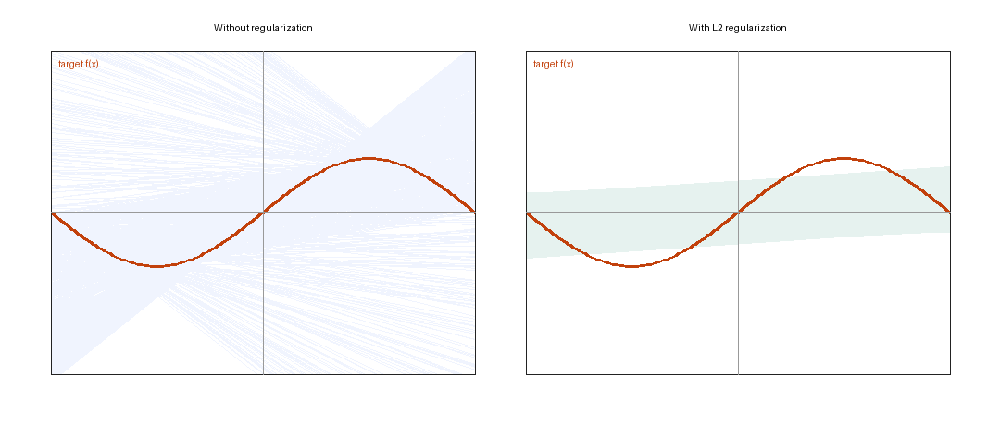

# Team: Lasiru Weerasuriya, Jack Gately
# CSC 665
# Assignment 4

## Problem I, Question 1

Hinge loss is a standard loss function for binary classification when the labels are written as y ∈ {-1,+1}. For a score h(x), the hinge loss is

$$
L(h(x),y) = max(0, 1-yh(x)).
$$

The quantity yh(x) is the margin. If yh(x) ≥ 1, the example is correctly classified and is far enough from the decision boundary, so the loss is zero. If 0 < yh(x) < 1, the classifier gets the sign right, but the point is still too close to the boundary and is penalized. If yh(x) ≤ 0, the point is misclassified and receives an even larger penalty.

This is why hinge loss is a natural objective for large-margin classification. It does not merely ask whether the sign of the prediction is correct; it also pushes correctly classified points away from the decision boundary. At the same time, hinge loss is convex, so it is easier to optimize than the discontinuous 0-1 classification loss. This is the same margin-based idea behind support vector machines, where the goal is to find a separating boundary with a large margin. The support-vector machine formulation was introduced by Cortes and Vapnik [1], and standard learning-theory texts describe hinge loss as a convex surrogate for classification loss [2,3]. Hinge loss is also useful in gradient-based and online methods because its subgradient is simple [4].

## Problem I, Question 2

The model is

$$
h(x₁,x₂) = w₀ + w₁x₁ + w₂x₂.
$$

Let

$$
m = yh(x₁,x₂)
$$

be the margin. Then the pointwise hinge loss can be written as

$$
c(h(x₁,x₂),y) =
{
  0,                if m ≥ 1
  1 - yh(x₁,x₂),    if m < 1.
}
$$

When m > 1, the loss is flat, so all three derivatives are zero:

$$
∂c/∂w₀ = 0,     ∂c/∂w₁ = 0,     ∂c/∂w₂ = 0.
$$

When m < 1, the loss is

$$
1 - y(w₀ + w₁x₁ + w₂x₂).
$$

Differentiating this expression gives

$$
∂c/∂w₀ = -y,
∂c/∂w₁ = -yx₁,
∂c/∂w₂ = -yx₂.
$$

At the corner m = 1, the ordinary derivative is not defined. A valid subgradient is any value between the zero side and the active hinge-loss side. If we write x₀ = 1, then a valid subgradient at m = 1 is

$$
∂c/∂w_j ∈ α(-yx_j),     where 0 ≤ α ≤ 1.
$$

For the hand calculation below, choosing the zero subgradient at m = 1 is valid.

## Problem I, Question 3

Starting from w = (0,0,0), the update rule for one example is

$$
w ← w + ηy(1,x₁,x₂)
$$

whenever yh(x₁,x₂) < 1. If yh(x₁,x₂) ≥ 1, the subgradient is zero and the weights do not change. Here η = 0.1.

| iteration | example (x₁,x₂,y) | margin before update | update? | weights after update (w₀,w₁,w₂) |
|---:|---:|---:|:---:|---:|
| 1 | (-4,0,-1) | 0.0 | yes | (-0.1, 0.4, 0.0) |
| 2 | (-1,1,+1) | -0.5 | yes | (0.0, 0.3, 0.1) |
| 3 | (0,-1,-1) | 0.1 | yes | (-0.1, 0.3, 0.2) |
| 4 | (2,1,+1) | 0.7 | yes | (0.0, 0.5, 0.3) |
| 5 | (3,0,+1) | 1.5 | no | (0.0, 0.5, 0.3) |
| 6 | (6,-1,-1) | -2.7 | yes | (-0.1, -0.1, 0.4) |

After one pass through the six examples, the SGD weights are

$$
(w₀,w₁,w₂)=(-0.1,-0.1,0.4).
$$

## Problem I, Question 4

Using the final SGD weights, the classifier is

$$
h(x₁,x₂) = -0.1 - 0.1x₁ + 0.4x₂.
$$

The prediction rule is +1 when h(x₁,x₂) ≥ 0, and -1 otherwise.

| i | h(x₁,x₂) | prediction | true label | correct? |
|---:|---:|:---:|:---:|:---:|
| 1 | 0.3 | +1 | -1 | no |
| 2 | 0.4 | +1 | +1 | yes |
| 3 | -0.5 | -1 | -1 | yes |
| 4 | 0.1 | +1 | +1 | yes |
| 5 | -0.4 | -1 | +1 | no |
| 6 | -1.1 | -1 | -1 | yes |

There are 2 mistakes out of 6 training examples, so the training misclassification rate is

$$
2/6 = 1/3 = 0.333333.
$$

## Problem I, Question 5 EC

The program `problem1_gd.py` runs batch gradient descent, using the full training set for each update. With step size η = 0.1 and stopping threshold 10⁻⁵, the batch method converged to a classifier with zero hinge loss on the training set.

| method | final weights | training error | hinge loss |
|:---|:---|---:|---:|
| one-pass SGD | (-0.1, -0.1, 0.4) | 0.333333 | 4.700000 |
| batch gradient descent | (-0.4, 0.5, 4.0) | 0.000000 | 0.000000 |

The batch-gradient classifier is not the same as the one-pass SGD classifier. This is expected because the SGD calculation only makes one pass through the data, while the batch method continues updating until the hinge-loss subgradient becomes zero.

## Problem II, Question 1

The unregularized cost function is

$$
C(w) = [y₁-(w₀+w₁x₁)]² + [y₂-(w₀+w₁x₂)]².
$$

For readability, define the two residuals

$$
r₁ = y₁ - (w₀+w₁x₁),
r₂ = y₂ - (w₀+w₁x₂).
$$

Then

$$
C(w)=r₁²+r₂².
$$

For w₀, each residual has derivative -1, so

$$
dC/dw₀ = -2r₁ - 2r₂.
$$

Substituting back for the residuals,

$$
dC/dw₀ =
-2[y₁-(w₀+w₁x₁)]
-2[y₂-(w₀+w₁x₂)].
$$

Equivalently,

$$
dC/dw₀ =
2(w₀+w₁x₁-y₁)
+ 2(w₀+w₁x₂-y₂).
$$

For w₁, the derivatives of the two residuals are -x₁ and -x₂, so

$$
dC/dw₁ = -2x₁r₁ - 2x₂r₂.
$$

Substituting back,

$$
dC/dw₁ =
-2x₁[y₁-(w₀+w₁x₁)]
-2x₂[y₂-(w₀+w₁x₂)].
$$

Equivalently,

$$
dC/dw₁ =
2x₁(w₀+w₁x₁-y₁)
+ 2x₂(w₀+w₁x₂-y₂).
$$

## Problem II, Question 2

With L₂ regularization, the cost function becomes

$$
C~(w)=[y₁-(w₀+w₁x₁)]² + [y₂-(w₀+w₁x₂)]² + λ(w₀²+w₁²).
$$

Using the same residuals r₁ and r₂, the regularized objective is

$$
C~(w)=r₁²+r₂²+λ(w₀²+w₁²).
$$

The regularization term contributes 2λw₀ to the w₀ derivative and 2λw₁ to the w₁ derivative. Therefore,

$$
dC~/dw₀ =
-2[y₁-(w₀+w₁x₁)]
-2[y₂-(w₀+w₁x₂)]
+ 2λw₀.
$$

Equivalently,

$$
dC~/dw₀ =
2(w₀+w₁x₁-y₁)
+ 2(w₀+w₁x₂-y₂)
+ 2λw₀.
$$

For w₁,

$$
dC~/dw₁ =
-2x₁[y₁-(w₀+w₁x₁)]
-2x₂[y₂-(w₀+w₁x₂)]
+ 2λw₁.
$$

Equivalently,

$$
dC~/dw₁ =
2x₁(w₀+w₁x₁-y₁)
+ 2x₂(w₀+w₁x₂-y₂)
+ 2λw₁.
$$

## Problem II, Question 3

The unregularized fitting function is submitted in `regularization.py`. Since the training set has exactly two points, the best unregularized line is the line through those points. For two examples (x₁,y₁) and (x₂,y₂),

$$
w₁ = (y₂-y₁)/(x₂-x₁),
and
w₀ = y₁ - w₁x₁.
$$

This gives zero training error for the two sampled points unless the two sampled x-values are identical.

## Problem II, Question 4

The regularized fitting function is also submitted in `regularization.py`. It starts from w₀ = w₁ = 0, uses step size η = 0.05, sets λ = 1, and performs 1000 gradient descent updates using the derivatives from Question 2.

## Problem II, Question 5

I ran 1000 trials. In each trial, two training examples were sampled from f(x)=sin(πx), then both the unregularized and regularized models were fit. The reported error is the average value returned by `test_error` across the 1000 trials. I used a fixed random seed so the experiment is reproducible.

| model | average test error |
|:---|---:|
| without regularization | 1.911505 |
| with L₂ regularization, λ = 1 | 0.436800 |

The regularized model has a much lower average test error. The unregularized model fits the two sampled points exactly, but with only two points this often creates a steep line that generalizes poorly. The L₂ penalty discourages large weights, so the fitted lines vary less from trial to trial.

## Problem II, Question 6 EC

The figure below plots the fitted line from each of the 1000 trials. The orange curve is the target function f(x)=sin(πx). The left panel shows the unregularized fits, and the right panel shows the L₂-regularized fits.

The regularized lines are much more concentrated, which matches the lower test error from Question 5. The plot illustrates the main effect of regularization in this experiment: it increases bias slightly but reduces variance substantially.

## References

[1] Cortes, C., and Vapnik, V. (1995). Support-vector networks. Machine Learning, 20, 273-297.

[2] Shalev-Shwartz, S., and Ben-David, S. (2014). Understanding Machine Learning: From Theory to Algorithms. Cambridge University Press.

[3] Cristianini, N., and Shawe-Taylor, J. (2000). An Introduction to Support Vector Machines and Other Kernel-Based Learning Methods. Cambridge University Press.

[4] Crammer, K., Dekel, O., Keshet, J., Shalev-Shwartz, S., and Singer, Y. (2006). Online passive-aggressive algorithms. Journal of Machine Learning Research, 7, 551-585.

## GenAI Usage Note

GenAI was used to help polish the written explanations, verify the hand calculations, and check the coding-output summaries for Problem I and Problem II. The final document was revised for clarity, and the numerical results were checked against the local program output.
